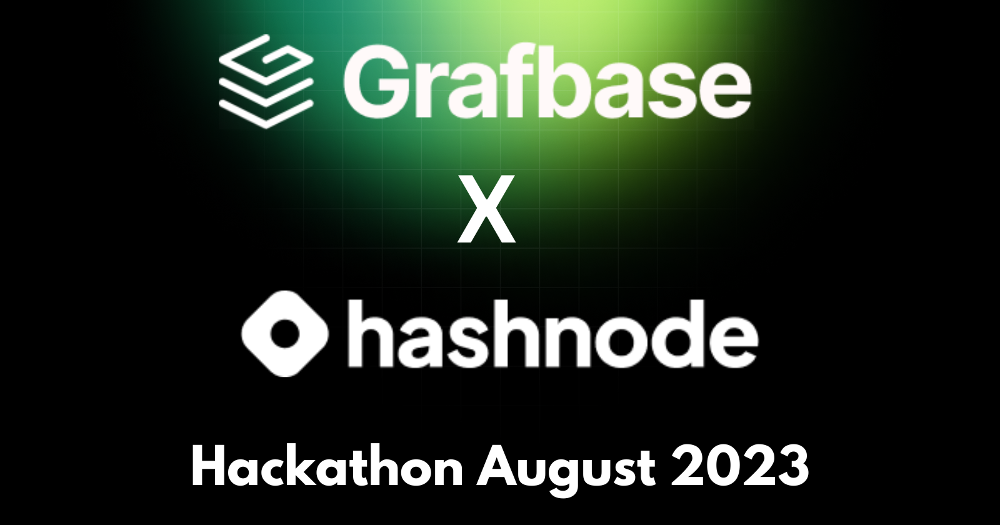
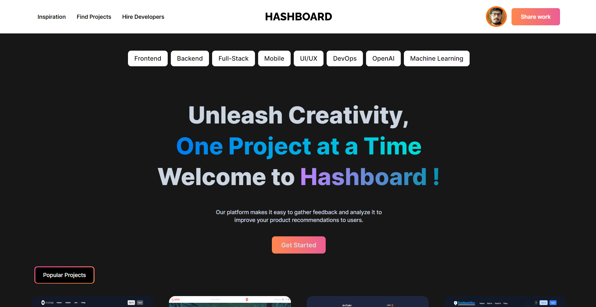

# Build with Grafbase Hackathon (Grafbase X Hashnode) — August 2023
  


### Project Task

**To Build an exciting Open-Source app of your choice using Grafbase as Backend and its other features during the whole of August. Publish an article on your Hashnode blog about the process of creating and launching your app for a chance to win one of the 5 cash prizes and swags!**

[Live Demo URL](https://hashboard.vercel.app/)




### Project Overview

It consits of :

* Header
* Hero Section
* Add/Create Project Page
* Profile Page
* Dashboard Page
* Project Showcase
* Footer
and many more....

and many more components...

### Tech Stack Used

- Next.js (Fullstack Framework for React.js)
- React.js (Front-end UI Library)
- Tailwind CSS (CSS Framework)
- Grafbase (For building GraphQL API and  Database)
- Vercel (For Hosting the App)

### UI Resources Used

* Images - (Google Images)
* SVG Icons - (Hero Icons by Tailwind CSS)
* Fonts (Inter)- (Google fonts)


### How to use  HashBoard

 

### The Code

Steps to run the app locally:


#### Step-1: Git Clone the project

```bash
   git clone https://github.com/raiv200/OneTask.git
```

#### Step-2: Install the dependencies

```bash
  npm install
```

#### Step-3: Add the Environment Variables in the (.env ) File

 1. First create a .env file in **root of the directory** and add the following environment variables.

 2. Also create one more .env file inside the **grafbase** folder and add the following environment variable.
d.

#### Step-4: Start the development server

Now open your project in your favorite IDE , (VsCode) and then start the development server.

```bash
   npm run dev
```


